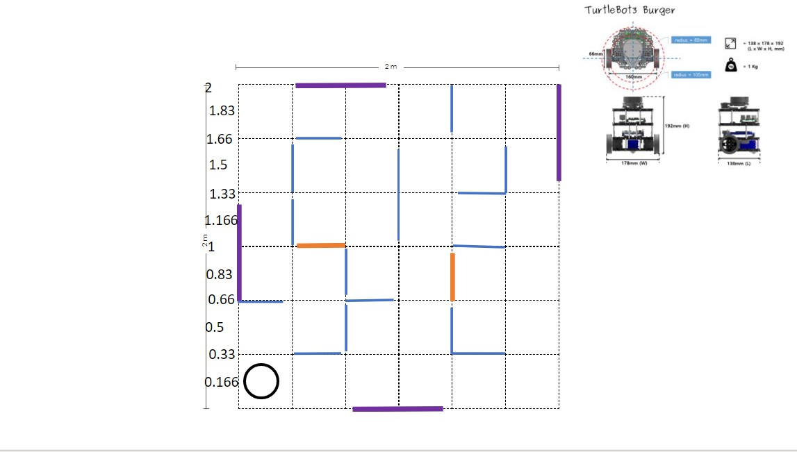

# Catch me if you can
This repository contains a ROS2 package for the multi-TurtleBot3 Play Tag game. In the Play Tag game, the TurtleBot3 acts as a "Police" robot that tries to catch other "Thief" robots by moving and navigating in the environment. In this project we design the map to 6'×'6 grid with 2'×'2 meters 2 inside doors and 4 escape doors.

## Purposed application
- Thief must try to avoid from police for a period of time until the escape door is unlocked
- Thief must try to escape with escape door while running away from police
- Police must try to catch the thief before the thief escape
- Map will have dynamic door that control with game controller for thief to juke the police

## Member
1. Chayanut Rassameecharoenchai 62340500012
2. Nachata Vongweeratorn 62340500030
3. Patcharapol Saechan 62340500036
4. Worameth Witanakorn 62340500045

## Functional requirements
- The thief must be able to run away from the police.
- The police must be able to chase the thief.
- The game controller must be able to open-close the door.
- The thief must be able to run to the escape door.

## Create map
Map sixe 2*2 m. divided by 6 in each column


## Implementing
Assume that you already have map or using in gazebo.
### Bringup both turtlebot3 with different namespace
```
ros2 launch turtlebot3 bringup_w_ns_launch.py
```
### Clone & Build the package
```
cd ~/turtlebot3_ws/src
git clone https://github.com/aumchayanut/mobot.git
cd ~/turtlebot3_ws/
colcon build
source install/setup.bash
```
Paste your map files in map directory
### Launch and run all necessaries node
```
ros2 launch custom_nav bringup_launch.py
ros2 launch custom_nav game_controller_launch.py
```
At this step, rviz could shows the map that you have. Then, your /tf topic could show like this

It's mean amcl already know the robot pose in map, so you can do the next step. Calling game controller service by call 'gamestate.sh'
```
./gamestate.sh
```
The game will start automatically. You can also interrupted to open the door by calling service in 'door.sh'
```
./door.sh
```
